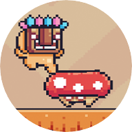
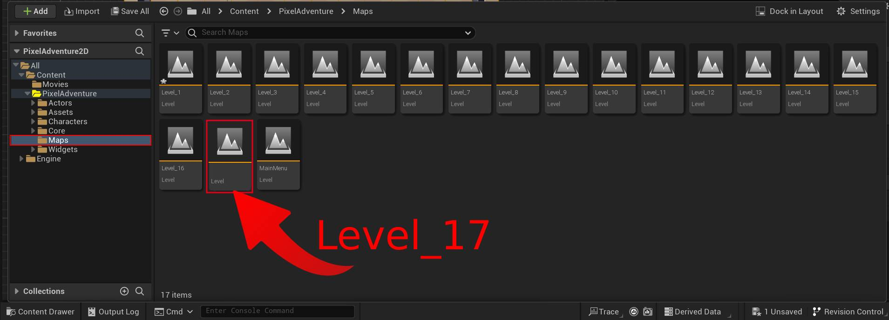
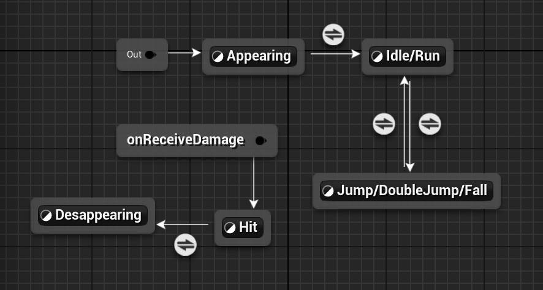
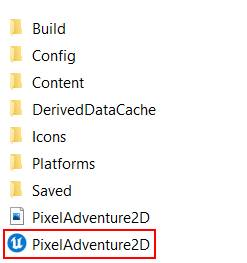

<h1 align="center">
  <br>
  <br>Pixel Adventure 2D<br>
</h1>

<h4 align="center">2D game project developed in Unreal Engine 5.2 using Blueprints.</h4>

<p align="center">
  <a href="#demonstration">Demonstration</a> •
  <a href="#objective">Objective</a> •
  <a href="#technologies">Features</a> •
  <a href="https://github.com/hnqca/PixelAdventure2D-UE5/archive/refs/heads/main.zip">Download</a> •
  <a href="#credits">Credits</a>
</p>


<a id="demonstration"></a>

## 📽 Demonstration:
Check out the already compiled project running on an Android device:

https://github.com/hnqca/PixelAdventure2D-UE5/assets/110671999/bea1213c-bb7d-4606-aec9-2b49d8d2f593

<a id="objective"></a>

## Game Objective:
Collect all the fruits scattered across the map to advance to the next level. Each level has its own difficulty and a different number of fruits to collect.

<a id="technologies"></a>

## Technologies:

- [PaperZD](https://www.unrealengine.com/marketplace/en-US/product/paperzd)
- 100% [Blueprints](https://docs.unrealengine.com/5.2/en-US/introduction-to-blueprints-visual-scripting-in-unreal-engine)
- Unreal Engine [5.2](https://www.unrealengine.com/en-US/blog/unreal-engine-5-2-is-now-available)

***

<a id="features"></a>

## Features:

- Game start intro (using the Unreal intro for demonstration).
- 1 playable character, including controls for walking, jumping, and double jumping.
- 16 levels ready to play.
- 9 varied enemies: ground-based, flying, and projectile-shooting. Each enemy has a unique trait.
- 12 traps, such as trampolines, spikes, moving platforms, and more.
- Death and level restart system.
- Automatic progress saving (current level, number of deaths, and fruits collected).
- Menu with level selection, allowing play only on unlocked levels.
- Level transition effect.
- Touch controls compatible with mobile devices.
- Sound effects and background music.

***

## Folder Structure:

```md
|-- Content
    |-- PixelAdventure
        |-- Actors
        |-- Assets
        |-- Characters
        |-- Core
        |-- Maps
        |-- Widgets
```

<details>
  <summary><b>Click here</b> to check out more details about the project's folder structure.</summary>

  #### 📁 Actors:

  > Contains all actor blueprints, including traps, pickups, and projectiles.

  #### 📁 Assets:

  > Here you will find sprites, flipbooks, sound effects, materials, tilemaps, tilesets, and particles used in the project.

  #### 📁 Characters:

  > All the logic and programming for the characters, including the main player and enemies.

  #### 📁 Core:

  > Input Actions, GameModes, Joystick, CameraShakes, Interfaces, SaveGame, GameInstance.

  #### 📁 Maps:

  > Contains all the game levels.

  #### 📁 Widgets:

  > Includes all the project's widgets, such as counters, buttons, and menus.

</details>
</details>

***

## Creating New Levels

You can find all the levels in the [Maps](https://github.com/hnqca/PixelAdventure2D-UE5/tree/main/PixelAdventure2D-UE5/Content/PixelAdventure/Maps) directory.

To create a new level, simply duplicate an existing level and rename it following the numerical sequence. For example: "**Level_17**," "**Level_18**," and so on. This will ensure that the player is automatically teleported to the corresponding next level.



***

## 🍉 Setting the Number of Fruits to Collect in the Level:

Simply drag and drop the actor "[BP_Pickup_Fruit](https://github.com/hnqca/PixelAdventure2D-UE5/blob/main/PixelAdventure2D-UE5/Content/PixelAdventure/Actors/Pickups/BP_Pickup_Fruit.uasset)" anywhere in the level. You can add as many fruits as you want.


***

## Moving Platform:

https://github.com/hnqca/PixelAdventure2D-UE5/assets/110671999/733c866d-3538-4fcb-9e39-4fc692d6f745

***

## Animated Background:

https://github.com/hnqca/PixelAdventure2D-UE5/assets/110671999/97bf813b-b355-4579-acb9-cbd234c1b307

***

## PaperZD

The PaperZD plugin was used to perform player and enemies animations.



***

## Unreal Download Project:

Download this project and open it by clicking on the **PixelAdventure2D.uproject**



***

## APK Android Download:

If you want to test the already compiled project on your Android device

you can download the APK by [clicking here](https://github.com/hnqca/PixelAdventure2D-UE5/raw/main/readme/PixelAdventure2D.apk).

***

<a id="credits"></a>

## Credits:

<table>
  <tr>
    <td align="center">
      <a href="https://pixelfrog-assets.itch.io/">
        <br>
        <sub>
          <b>Pixel Frog</b><br>
      </a>
          <b>Assets</b>
        </sub>
    </td>
    <td align="center">
      <a href="https://soundcloud.com/heatleybros">
        <br>
        <sub>
          <b>HeatleyBros</b><br>
      </a>
          <b>Music</b>
        </sub>
    </td>
  </tr>
</table>

***

This project is completely free. Feel free to download, edit, and create your own game using this template.

If you found this project useful and would like to show your support, consider [buying me a coffee!](https://ko-fi.com/hnqca) :)
